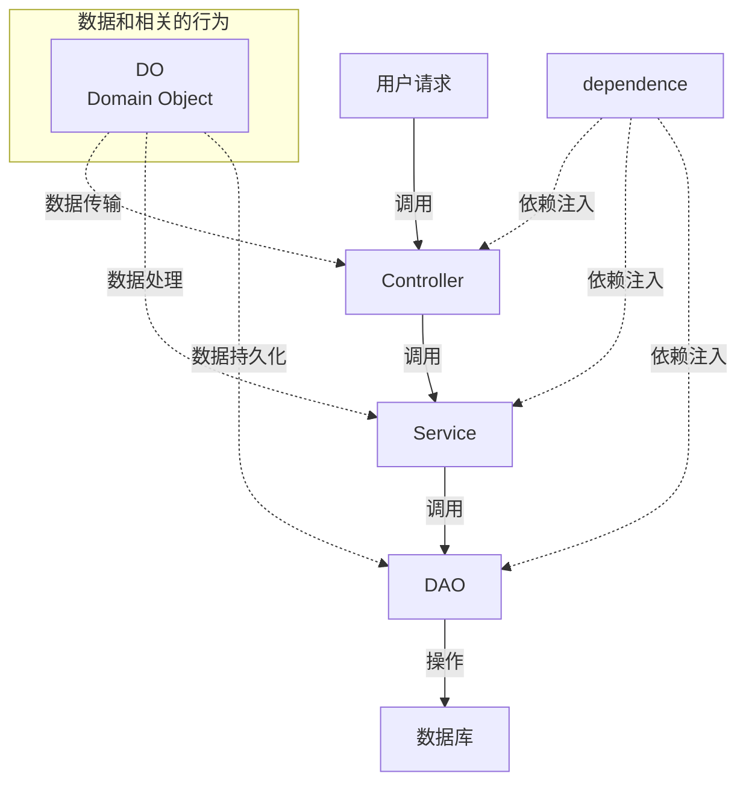

# base_server

项目后端基线库

## 项目结构

## 开发

```bash
# 拉取基础代码(如果需要)
git clone http://zwork1.w1.luyouxia.net/gitea/codebiu_2025/base_server.git

# 版本和三方库在pyproject.toml里，安装依赖(需要uv包管理 ) 
uv sync

# 运行
.venv\Scripts\python.exe src\app.py

```

## 测试

```sh
# pytest配置
# .vscode\settings.json里添加
{
  "python.testing.pytestArgs": [
    "-v",          // 显示详细输出
    "-s",          // 禁用输出捕获(关键！)
    "--log-cli-level=INFO"  //  启用日志输出到控制台
  ]
}
```

## 打包exe或docker

```sh
# dev
bash build/docker_dev/build.sh
# 构建 exe bin
bash build/docker_build/linux_build.sh
bash build/docker_build/build.sh

# 运行
docker compose up
docker compose down
docker compose 
```

## 基础mvc分层



## 项目文档

- [版本信息](./doc/tag_doc/version_info.md)
- [依赖库](./doc/dev/lib.md)
- [项目目录](./doc/dev/dir.md)
