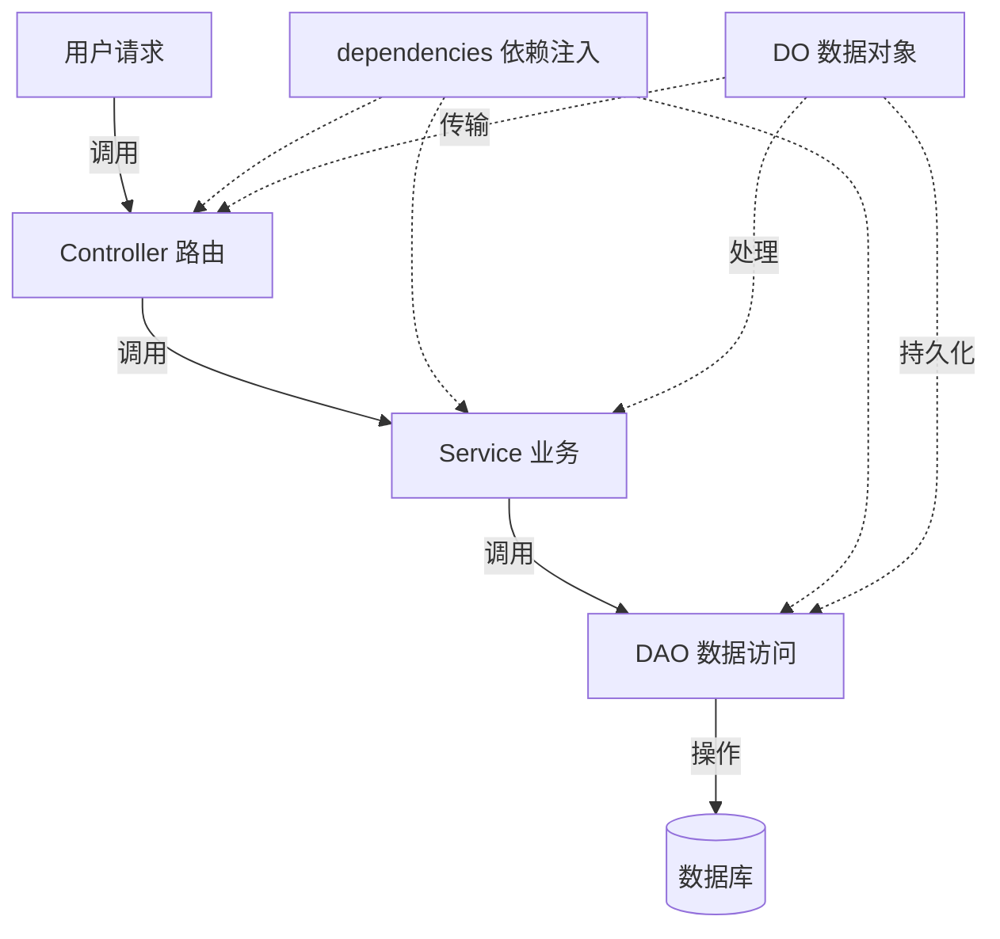

# 后端结构：MVC 分层

## 一个请求的生命周期

## 各层职责

| 层 | 目录 | 职责 |
| :---: | :---: | :--- |
| Controller | `controller/` | 定义路由、参数校验、调 Service |
| Service | `service/` | 业务逻辑、事务(`@DaoRel`) |
| DAO | `dao/` | 数据库 CRUD 封装 |
| DO | `do/` | 表模型 + Pydantic 模型 |
| Config | `config/` | 模块路由挂载 + 配置 |
| Dependencies | `dependencies/` | FastAPI 依赖注入工厂 |

事务约定: DAO 方法加 <code>@DaoRel</code> 装饰器自动管理 session, Service 直接调用即可。

