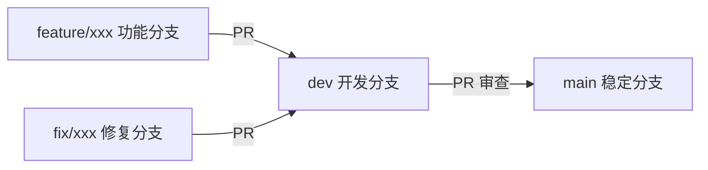

# Git 协作规范

## 分支模型

## 提交约定

| 类型 | 说明 | 示例 |
| :---: | :--- | :--- |
| `feat` | 新功能 | `feat: 新增文件移动功能` |
| `fix` | 修 bug | `fix: 修复下载路径错误` |
| `docs` | 文档 | `docs: 补充部署手册` |
| `refactor` | 重构 | `refactor: 抽离存储层` |
| `test` | 测试 | `test: 补充分页用例` |

## PR 审查要点

- 分支从 `dev` 拉出，PR 也合回 `dev`
- 一个 PR 只做一件事
- 描述**为什么**改，而不仅是改了什么
- 版本节点在 `doc/tag_doc/` 记录

新人建议路径: 修一个 <code>tag_todo.md</code> 里的小任务 → 提 PR → 熟悉审查流程。

