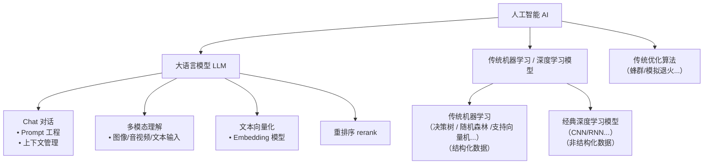

## 大语言模型（LLM）工程化使用基础

大语言模型（Large Language Model, LLM）是一种基于深度学习的自然语言处理模型，能够执行文本生成、问答、翻译等多种任务。在现代智能系统中，LLM 通常作为信息检索与决策支持的核心组件。

需要指出的是，我们通常所说的“AI”不仅包括大语言模型（LLM），也涵盖传统机器学习方法 / 深度学习模型（如决策树、逻辑回归、支持向量机、卷积神经网络 CNN、循环神经网络 RNN 及其变体 LSTM/GRU 等），还有一些蜂群和模拟退火等传统优化算法。

这些方法与大语言模型在多个维度上存在显著差异——包括训练成本、推理速度、可解释性、部署复杂度、数据依赖性以及对硬件资源的需求等。例如，传统机器学习方法通常轻量、可解释性强，适合结构化数据和资源受限场景；深度学习模型在图像、语音、时序等感知任务中表现优异，且推理效率较高；而 LLM 则擅长通用语言理解与生成，但计算开销大、幻觉风险高。

因此，在实际工程应用中，需根据任务类型、数据形态、性能要求和资源约束，合理选择甚至融合不同技术路线，而非盲目追求“大模型”。

即使仅聚焦于 LLM，其工程化落地也面临诸多考量：  
- **部署与并发**：无论是本地部署还是远程调用（如通过 API），均需针对不同模型的推理能力合理规划并发处理策略，以保障系统吞吐与响应延迟。  
- **模型规模与性能**：参数量直接影响计算资源消耗、内存占用及推理延迟，需在效果与效率之间取得平衡。  
- **多模态支持**：部分场景要求模型处理文本以外的输入形式（如图像、音频），需评估模型是否具备多模态理解与生成能力。  
- **检索增强设计**：在基于检索增强生成（RAG）等架构中，需综合设计向量数据库的嵌入维度、相似度度量方法，并合理配置向量检索与传统检索策略（如关键词匹配）的融合权重，以提升召回质量。  
- **可靠性与幻觉控制**：当模型参数量不足，或预训练知识与专业领域不匹配时，容易产生事实性错误或“幻觉”输出，需通过微调、提示工程、外部知识校验等手段加以缓解。

LLM 的工程化应用远不止调用 API，而是一项涉及模型选型、系统架构、性能优化与成本控制的综合性工程任务。

---

### 1. LLM调用流程（阿里云api 通用openai方式）

1. 获取LLM的API接口
2. 获取API接口的调用方式
3. 获取API接口的调用参数
4. 调用API接口
5. 解析API接口返回结果
6. 处理API接口返回结果（流式非流式）

#### 1.1 阿里云api密钥注册和使用
各个平台一般会有免费额度用于试用练习

1. [注册一个阿里云百炼平台账号并登录](https://bailian.console.aliyun.com/?spm=5176.29619931.J_SEsSjsNv72yRuRFS2VknO.2.25cb405fzZQGs9&tab=model#/model-market)

2. 实名后 密钥管理 -> 创建密钥sk-***

3. [参考qwen3-4b（便宜的api里面效果勉强可用的，且可以后续本地方便部署）的api文档使用密钥](https://bailian.console.aliyun.com/?spm=5176.29619931.J_SEsSjsNv72yRuRFS2VknO.2.25cb405fzZQGs9&tab=model#/model-market/detail/qwen3-4b)

4.  结合项目内moudle_ai模块结合langchain加深理解

{  
  "model_type": "chat",  
  "server_type": "openai",  
  "model": "qwen3-4b",  
  "url": "https://dashscope.aliyuncs.com/compatible-mode/v1",  
  "api_key": "sk-**",  
  "pay_in": 0.3,  
  "pay_out": 1.2,  
  "input_tokens": 32768,  
  "out_tokens": 8192,  
  "temperature": 0.7,  
  "timeout": 60,  
  "no_think": true  
}   

### 2.langchain入门

### 3.langgraph入门

### 4. 其他LLM调用流程（本地ollama api/嵌入app）
