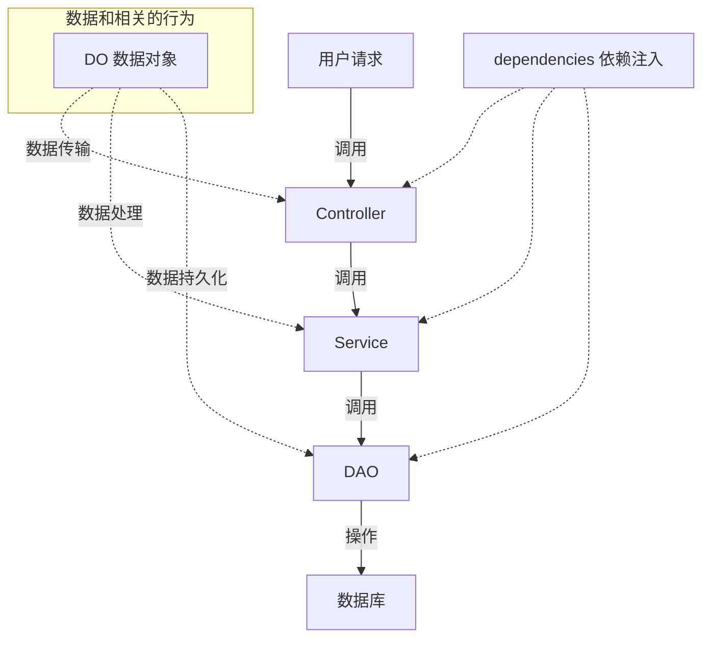

# 后端开发指南

> 后端基线库：`code/backend/server_py`，技术栈 **Python 3.13 + FastAPI + SQLAlchemy 2.0(异步) + PostgreSQL**。
> 本指南面向新加入的开发者，读完可以独立完成一个业务模块的开发。

## 1. 启动与调试

```bash
cd code/backend/server_py

# 安装依赖(uv 自动管理 Python 3.13 虚拟环境)
uv sync

# 复制配置并按需修改数据库连接
# config.yaml → config.dev.yaml

# 方式一: 直接运行(会自动结束旧进程)
.venv\Scripts\python.exe src\app.py

# 方式二: 控制台 uvicorn(支持 reload)
$env:PYTHONPATH="src"; uvicorn src.app:app --host 0.0.0.0 --port 2001 --reload
```

启动成功后访问 Swagger 文档：`http://127.0.0.1:2001/template/docs`

## 2. 目录结构

```
server_py/
├── src/
│   ├── common/                 # 公共层(全局配置/工具)
│   │   ├── config/             # server(FastAPI实例)/db(数据库)/log/conf(配置读取)
│   │   ├── utils/db/           # 分页schema、db工厂
│   │   └── utils/security/     # 密码加密、token
│   ├── module_main/            # 字典/状态/数据概览
│   ├── module_authorization/   # 用户/角色/权限/Token(含casbin)
│   ├── module_file/            # 虚拟文件系统
│   ├── module_rag/             # 知识库(项目/文档/对话)
│   ├── module_ai/              # LLM/OCR/语音
│   └── module_template/        # ★ 模板模块(新模块开发参考)
├── config.yaml                 # 全局配置(复制为 config.dev.yaml 使用)
├── pyproject.toml              # 依赖声明(uv 管理)
└── tests/                      # pytest 测试
```

## 3. MVC 分层与请求链路



| 层 | 目录 | 职责 | 约定 |
| :---: | :---: | :--- | :--- |
| Controller | `controller/` | 路由定义、参数校验、调 Service、返回 DO | 不写业务逻辑 |
| Service | `service/` | 业务逻辑、跨 DAO 组合 | 事务由 `@DaoRel` 托管 |
| DAO | `dao/` | 单表 CRUD 封装 | 方法挂 `@DaoRel` 装饰器 |
| DO | `do/` | 表模型 + Create/Update Pydantic 模型 | 命名 `XxxCreate`/`XxxUpdate` |
| Config | `config/` | 模块子应用挂载、模块级配置 | `server.py` 固定写法 |
| Dependencies | `dependencies/` | FastAPI 依赖注入工厂 | 如 `get_xxx_service` |

## 4. 新模块开发六步法

以新建 `module_demo` 为例，全程参考 `module_template`：

### ① 创建目录与路由挂载

`src/module_demo/config/server.py`：

```python
from common.config.server import app
from fastapi import FastAPI
import logging

logger = logging.getLogger(__name__)

module_app = FastAPI()
app.mount("/demo", module_app)  # 模块统一挂载到子路径

logger.info("ok...server module_demo服务配置")
```

### ② 定义数据对象 do/

`do/demo.py` 中定义表模型与出入参模型：

```python
# 表模型(SQLModel) + Pydantic 模式(Create/Update)
class Demo(SQLModel, table=True):
    id: str = Field(default_factory=lambda: str(uuid4()))
    name: str
    is_active: bool = True

class DemoCreate(BaseModel):
    name: str
```

### ③ DAO 数据访问层 dao/

```python
from common.utils.db.decorator import DaoRel  # 事务装饰器

class DemoDAO:
    @DaoRel
    async def get_all(self, session: AsyncSession | None = None):
        """查询全部示例数据"""
        statement = select(Demo).where(Demo.is_active == True)  # noqa: E712
        return (await session.exec(statement)).all()
```

### ④ Service 业务层 service/

组合多个 DAO 完成业务逻辑，异常用 `ValueError` 抛出，由 Controller 转 HTTP 状态码。

### ⑤ Controller 路由层 controller/

```python
from module_demo.config.server import module_app
from module_demo.dependencies.demo import get_demo_service

router = APIRouter()

@router.get("/list", response_model=list[Demo])
async def list_demo(service = Depends(get_demo_service)):
    """查询示例列表"""
    return await service.list_all()

# 文件末尾统一注册到模块子应用
module_app.include_router(router, prefix="/demo", tags=["示例模块"])
```

### ⑥ 主应用引入

`src/app.py` 添加：

```python
from module_demo.controller import demo  # noqa: F401 触发路由注册
```

## 5. 数据库与配置

- **配置文件**：`config.yaml`(模板) → `config.dev.yaml`(开发) → 生产用环境变量/`config.yaml`
- **自动建表**：应用启动时按 DO 定义自动创建缺失表(幂等)
- **分页**：统一使用 `common/utils/db/schema/pagination.py` 的
  `PaginationParams` / `PaginationResponse` 与 `InfiniteScrollParams` / `InfiniteScrollResponse`
- **Python 语法**：统一 Python 3.13 新语法，类型标注用 `str | None`，**不使用** `typing.Optional`/`Union`

## 6. 测试

```bash
# 运行全部测试
uv run pytest

# vscode settings.json 推荐 pytest 参数
{
  "python.testing.pytestArgs": ["-v", "-s", "--log-cli-level=INFO"]
}
```

## 7. 常见问题

| 现象 | 排查 |
| :--- | :--- |
| 端口占用 | `app.py` 启动会自动 kill 旧进程；手动查 `netstat -ano \| findstr 2001` |
| 模块路由 404 | 确认 `app.py` 引入了 controller；确认 `include_router` 在模块 controller 文件末尾执行 |
| 表未生成 | 检查 DO 是否被 `db.py` 的模型注册引用 |
| 权限 403 | 路由挂了 `require_permission` 但 casbin 未声明规则(见权限体系文档) |

## 相关文档

- [前端开发指南](./4.前端开发.md)
- [权限体系](./5.权限体系.md)
- [开发环境配置](../../开发部署/环境配置/开发环境.md)
- [代码规范](../../开发部署/规范/代码规范.md)
- 快速上手演示：`doc/doc_ch/ppt`(Slidev 入门 PPT)
